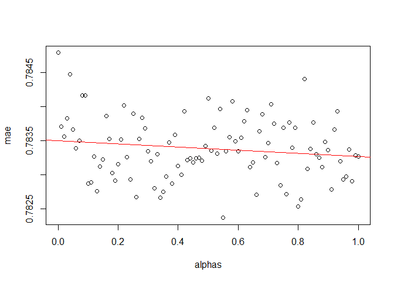

Pillar 1 - Student Topic Profile
================
DARS
2019-04-16

-   [Course topic profile](#course-topic-profile)
-   [Student topic profile](#student-topic-profile)
-   [Student GPA](#student-gpa)
-   [Join student TP and GPA](#join-student-tp-and-gpa)
-   [Regressing grade on TP and GPA](#regressing-grade-on-tp-and-gpa)
    -   [Lasso](#lasso)
-   [Preparatory courses](#preparatory-courses)
-   [Save](#save)
-   [Predict](#predict)
-   [Extra: find best alpha](#extra-find-best-alpha)

**Considerations**:

-   extract course descriptions from courses not offer in 2018-2019 e.g. SCI2012.
-   give more weight to 3000-level courses

-   consider following predictors:
    -   GPA (per concentration)

``` r
load("App/Recommender System/topic_model_gb.RDATA")
load("Output/data_pillar_1.RDATA")
load("Output/course_current.RDATA")

course_target <- course_current[! str_detect(course_current, "...10..")]
course_target <- union(course_target, str_subset(course_current, "COR"))# include core courses
```

Course topic profile
====================

``` r
gamma        <- topic_model_gb$g_overview[[15]] %>% mutate(topic = topic %>% str_replace(" ", "_"))
gamma_spread <- gamma %>% spread(topic, gamma)

beta <- topic_model_gb$b_overview[[15]] %>% group_by(topic) %>% top_n(15, beta)
```

Student topic profile
=====================

``` r
student_TP <- d_transcript_augmented %>% 
  
  left_join(gamma_spread, by = c("Course ID" = "document")) %>%
  
  mutate_at(vars(matches("Topic")), .funs = funs(if_else(is.na(.), 0, .))) %>% # give a value of 0 to the topics of the courses missing from the topic model.
  mutate_at(vars(matches("Topic")), .funs = funs(Grade/10 * .)) %>% # weigh by grade
  
  group_by(`Student ID`, time) %>%
  summarize_at(vars(matches("Topic")), sum) %>% 
  
  group_by(`Student ID`) %>%
  arrange(time) %>%
  
  mutate_at(vars(matches("Topic")), lag, default = 0) %>%
  mutate_at(vars(matches("Topic")), cumsum) %>% # topic profile at beginning of period
  
  ungroup %>%
  
  arrange(`Student ID`)
```

Raphael's topic profile is coherent: topics with a high value correspond to my academic focus and topics with a low score to themes I never covered (i.e. law, literature).

Student GPA
===========

``` r
d_transcript_augmented <- d_transcript_augmented %>%
  
  mutate(is_HUM = `Course ID` %>% str_detect("HUM|SAH"),
         is_SCI = `Course ID` %>% str_detect("SCI|SAS"),
         is_SSC = `Course ID` %>% str_detect("SSC|SAC"),
         is_COR = `Course ID` %>% str_detect("COR"),
         is_SKI = `Course ID` %>% str_detect("SKI|LAN"),
         is_PRO = `Course ID` %>% str_detect("PRO|UGR|CAP")) %>%
  
  mutate(grade_HUM = if_else(is_HUM, Grade, NA_real_),
         grade_SCI = if_else(is_SCI, Grade, NA_real_),
         grade_SSC = if_else(is_SSC, Grade, NA_real_),
         grade_COR = if_else(is_COR, Grade, NA_real_),
         grade_SKI = if_else(is_SKI, Grade, NA_real_),
         grade_PRO = if_else(is_PRO, Grade, NA_real_)) %>%  
  
  mutate(ECTS = case_when(
    `Course ID` %>% str_detect("HUM|SCI|SSC|COR|PRO|SA|EXT") ~ 5  ,
    `Course ID` %>% str_detect("SKI|LAN"                   ) ~ 2.5,
    `Course ID` %>% str_detect("CAP|UGR"                   ) ~ 10 ,
    TRUE                                                     ~ 5  )
    ) %>%

  mutate(ECTS_HUM = if_else(is_HUM, ECTS, NA_real_),
         ECTS_SCI = if_else(is_SCI, ECTS, NA_real_),
         ECTS_SSC = if_else(is_SSC, ECTS, NA_real_),
         ECTS_COR = if_else(is_COR, ECTS, NA_real_),
         ECTS_SKI = if_else(is_SKI, ECTS, NA_real_),
         ECTS_PRO = if_else(is_PRO, ECTS, NA_real_)) %>%
  
  mutate(grade_ECTS     = Grade     * ECTS,
         grade_ECTS_HUM = grade_HUM * ECTS_HUM,
         grade_ECTS_SCI = grade_SCI * ECTS_SCI,
         grade_ECTS_SSC = grade_SSC * ECTS_SSC,
         grade_ECTS_COR = grade_COR * ECTS_COR,
         grade_ECTS_SKI = grade_SKI * ECTS_SKI,
         grade_ECTS_PRO = grade_PRO * ECTS_PRO)
```

``` r
student_GPA <- d_transcript_augmented %>%
  
  group_by(`Student ID`, time) %>%
  summarize_at(vars(matches("ECTS")), list) %>%
  
  group_by(`Student ID`) %>%
  arrange(time) %>%
  
  mutate_at(vars(matches("ECTS")), purrr::accumulate, c) %>%
  
  mutate_at(vars(matches("ECTS")), map_dbl, sum, na.rm = TRUE) %>%
  
  mutate(GPA     = grade_ECTS     / ECTS,
         GPA_HUM = grade_ECTS_HUM / ECTS_HUM,
         GPA_SCI = grade_ECTS_SCI / ECTS_SCI,
         GPA_SSC = grade_ECTS_SSC / ECTS_SSC,
         GPA_COR = grade_ECTS_COR / ECTS_COR,
         GPA_SKI = grade_ECTS_SKI / ECTS_SKI,
         GPA_PRO = grade_ECTS_PRO / ECTS_PRO) %>%
  
  mutate_at(vars(matches("GPA")), lag) %>%
  
  mutate_at(vars(matches("GPA")), ~ if_else(is.na(.), mean(d_transcript_augmented$Grade), .)) %>% # substitute missing GPA with the mean GPA across all courses (GPA_HUM is missing if student has no taken any HUM course yet)
  
  arrange(`Student ID`) 
```

Join student TP and GPA
=======================

``` r
student_profile <- d_transcript_augmented %>%
  
  left_join(student_GPA, by = c("Student ID", "time")) %>%
  
  left_join(student_TP , by = c("Student ID", "time"))
```

``` r
student_profile_nest <- student_profile %>%
  
  nest(.key = profile, matches("GPA|Topic")) %>%
  
  mutate(profile = profile %>% map(as.matrix))
```

Regressing grade on TP and GPA
==============================

``` r
find_df <- function(course)  student_profile %>% filter(`Course ID` == course)
```

Lasso
-----

``` r
my_cv.glmnet <- function(df, alpha = 1, predictors){
  
  df <- df %>% select(Grade, matches(predictors))
  
  y <- df[names(df) == "Grade"] %>% as.matrix
  x <- df[names(df) != "Grade"] %>% as.matrix
  
  nfold <- min(10, floor(nrow(df) / 3))
  
  cv.glmnet(x, y, nfolds = nfold, type.measure = "mae", alpha = alpha)
  
}
```

``` r
fit_lasso <- tibble(target = course_target) %>%
  
  mutate(d = target %>% map(find_df),
         n = d      %>% map_dbl(nrow)) %>%
  
  filter(n > 20) %>%
  
  mutate(cv = d %>% map(my_cv.glmnet, predictors = "GPA|Topic")) %>%
  
  select(-d)
```

``` r
fit_lasso <- fit_lasso %>%
  
  # Results from CV
  mutate(m_lasso      = cv %>% map    (~ .[["glmnet.fit"]]),
         lambda_min   = cv %>% map_dbl(~ .[["lambda.min"]]),
         lambda_1se   = cv %>% map_dbl(~ .[["lambda.1se"]]),
         index_best   = cv %>% map_dbl(~ which.min(.[["cvm"]])),
         cv_error     = list(cv, index_best) %>% pmap_dbl(~ ..1[["cvm"]][..2]),
         cv_error_sd  = list(cv, index_best) %>% pmap_dbl(~ ..1[["cvsd"]][..2])
         ) %>%
  
  # Best model
  mutate(
    
    intercept  = list(m_lasso, index_best) %>% pmap_dbl(~ ..1[["a0"]][..2]),
    coefi      = list(m_lasso, lambda_min) %>% pmap(coef), # clearer output than pmap_dbl(~ ..1[["beta"]][,..2])
    df         = list(m_lasso, index_best) %>% pmap_dbl(~ ..1[["df"]][..2]),
    
    dev_null   = m_lasso %>% map_dbl(~ .[["nulldev"]]),
    dev_left   = list(m_lasso, index_best) %>% pmap_dbl(~deviance.glmnet(..1)[..2]),
    dev_unexpl = dev_null - dev_left,
    dev_ratio  = list(m_lasso, index_best) %>% pmap_dbl(~ ..1[["dev.ratio"]][..2])
    
  ) %>%
  
  select(- m_lasso) %>%
  
  arrange(cv_error)
```

``` r
hist(fit_lasso$cv_error)
```


``` r
mean(fit_lasso$cv_error); weighted.mean(fit_lasso$cv_error, fit_lasso$n)
```

    ## [1] 0.8049792

    ## [1] 0.7743765

Topic chosen by model are related to the course.

``` r
beta <- topic_model_gb$b_overview[[15]] %>% group_by(topic) %>% top_n(15, beta)

i <- 2; fit_lasso$coefi[[i]]; fit_lasso$target[[i]] # Contemporary Classical Sociology: topic ~ law, foreign policy, culture
```

    ## 38 x 1 sparse Matrix of class "dgCMatrix"
    ##                        1
    ## (Intercept)  3.623075583
    ## GPA          0.278878194
    ## GPA_HUM      .          
    ## GPA_SCI      0.024351817
    ## GPA_SSC      0.006535114
    ## GPA_COR      .          
    ## GPA_SKI      0.231453495
    ## GPA_PRO      .          
    ## Topic_1      .          
    ## Topic_10     .          
    ## Topic_11     .          
    ## Topic_12     .          
    ## Topic_13     .          
    ## Topic_14     .          
    ## Topic_15     .          
    ## Topic_16     .          
    ## Topic_17     0.048710957
    ## Topic_18     0.103270722
    ## Topic_19     .          
    ## Topic_2      .          
    ## Topic_20     .          
    ## Topic_21     .          
    ## Topic_22     .          
    ## Topic_23     .          
    ## Topic_24     .          
    ## Topic_25    -0.199076567
    ## Topic_26     .          
    ## Topic_27     .          
    ## Topic_28     .          
    ## Topic_29     .          
    ## Topic_3      .          
    ## Topic_30     .          
    ## Topic_4      .          
    ## Topic_5      .          
    ## Topic_6      .          
    ## Topic_7      .          
    ## Topic_8      0.136020985
    ## Topic_9      .

    ## [1] "SSC3038"

``` r
beta %>% filter(topic == "Topic 18")
```

    ## # A tibble: 15 x 3
    ## # Groups:   topic [1]
    ##    topic    term           beta
    ##    <chr>    <chr>         <dbl>
    ##  1 Topic 18 art         0.0507 
    ##  2 Topic 18 century     0.0347 
    ##  3 Topic 18 modern      0.0245 
    ##  4 Topic 18 temporary   0.0195 
    ##  5 Topic 18 artistic    0.0153 
    ##  6 Topic 18 performance 0.0127 
    ##  7 Topic 18 london      0.00936
    ##  8 Topic 18 familiarize 0.00852
    ##  9 Topic 18 20th        0.00852
    ## 10 Topic 18 enable      0.00767
    ## 11 Topic 18 maastricht  0.00683
    ## 12 Topic 18 stance      0.00683
    ## 13 Topic 18 ha          0.00683
    ## 14 Topic 18 reality     0.00599
    ## 15 Topic 18 initiate    0.00599

``` r
beta %>% filter(topic == "Topic 8" )
```

    ## # A tibble: 15 x 3
    ## # Groups:   topic [1]
    ##    topic   term           beta
    ##    <chr>   <chr>         <dbl>
    ##  1 Topic 8 study       0.0590 
    ##  2 Topic 8 cultural    0.0490 
    ##  3 Topic 8 culture     0.0270 
    ##  4 Topic 8 gender      0.0245 
    ##  5 Topic 8 identity    0.0230 
    ##  6 Topic 8 humanity    0.0170 
    ##  7 Topic 8 class       0.0155 
    ##  8 Topic 8 differences 0.0140 
    ##  9 Topic 8 perspective 0.0135 
    ## 10 Topic 8 visual      0.0125 
    ## 11 Topic 8 critical    0.0110 
    ## 12 Topic 8 examine     0.0110 
    ## 13 Topic 8 diversity   0.0105 
    ## 14 Topic 8 shape       0.0100 
    ## 15 Topic 8 historical  0.00955

``` r
i <- 12; fit_lasso$coefi[[i]]; fit_lasso$target[[i]] # Business Administration: topic ~ business
```

    ## 38 x 1 sparse Matrix of class "dgCMatrix"
    ##                        1
    ## (Intercept)  6.062007037
    ## GPA          0.147095588
    ## GPA_HUM      .          
    ## GPA_SCI      0.005736446
    ## GPA_SSC      .          
    ## GPA_COR      .          
    ## GPA_SKI      0.050351697
    ## GPA_PRO      0.013674573
    ## Topic_1      .          
    ## Topic_10    -0.133472817
    ## Topic_11    -0.568157564
    ## Topic_12     .          
    ## Topic_13     0.075135660
    ## Topic_14    -0.064848221
    ## Topic_15    -0.058294951
    ## Topic_16     0.152868714
    ## Topic_17     .          
    ## Topic_18    -0.476662808
    ## Topic_19     .          
    ## Topic_2      0.032824202
    ## Topic_20     .          
    ## Topic_21     0.068198017
    ## Topic_22     0.007171636
    ## Topic_23     0.019900867
    ## Topic_24     .          
    ## Topic_25     .          
    ## Topic_26     .          
    ## Topic_27     .          
    ## Topic_28    -0.122044662
    ## Topic_29    -0.030238503
    ## Topic_3      .          
    ## Topic_30     0.099328610
    ## Topic_4      .          
    ## Topic_5      0.152802942
    ## Topic_6     -0.280079172
    ## Topic_7      .          
    ## Topic_8      .          
    ## Topic_9      0.036379230

    ## [1] "PRO3008"

``` r
beta %>% filter(topic == "Topic 19")
```

    ## # A tibble: 15 x 3
    ## # Groups:   topic [1]
    ##    topic    term             beta
    ##    <chr>    <chr>           <dbl>
    ##  1 Topic 19 trade         0.0278 
    ##  2 Topic 19 international 0.0226 
    ##  3 Topic 19 negotiate     0.0174 
    ##  4 Topic 19 economic      0.0166 
    ##  5 Topic 19 strategy      0.0148 
    ##  6 Topic 19 country       0.0148 
    ##  7 Topic 19 wto           0.0131 
    ##  8 Topic 19 rule          0.0122 
    ##  9 Topic 19 tail          0.00963
    ## 10 Topic 19 simulate      0.00876
    ## 11 Topic 19 numb          0.00789
    ## 12 Topic 19 text          0.00703
    ## 13 Topic 19 crisis        0.00703
    ## 14 Topic 19 negotiations  0.00703
    ## 15 Topic 19 organization  0.00616

``` r
i <- 3; fit_lasso$coefi[[i]]; fit_lasso$target[[i]] # Culture, Politics and SOciety in Contemporary Asia: topic ~ law, international, policy
```

    ## 38 x 1 sparse Matrix of class "dgCMatrix"
    ##                       1
    ## (Intercept)  4.61939610
    ## GPA          0.06502965
    ## GPA_HUM      .         
    ## GPA_SCI      .         
    ## GPA_SSC      0.23313780
    ## GPA_COR      0.01720849
    ## GPA_SKI      0.11705323
    ## GPA_PRO      .         
    ## Topic_1      .         
    ## Topic_10     .         
    ## Topic_11     .         
    ## Topic_12     .         
    ## Topic_13     .         
    ## Topic_14     .         
    ## Topic_15     .         
    ## Topic_16     .         
    ## Topic_17     .         
    ## Topic_18     .         
    ## Topic_19     .         
    ## Topic_2      .         
    ## Topic_20     .         
    ## Topic_21     0.16414125
    ## Topic_22     .         
    ## Topic_23     0.31569578
    ## Topic_24     .         
    ## Topic_25     .         
    ## Topic_26    -0.12712832
    ## Topic_27     .         
    ## Topic_28     .         
    ## Topic_29     .         
    ## Topic_3      .         
    ## Topic_30     .         
    ## Topic_4      .         
    ## Topic_5      .         
    ## Topic_6      .         
    ## Topic_7      .         
    ## Topic_8      .         
    ## Topic_9      .

    ## [1] "SSC3044"

``` r
beta %>% filter(topic == "Topic 21") 
```

    ## # A tibble: 17 x 3
    ## # Groups:   topic [1]
    ##    topic    term             beta
    ##    <chr>    <chr>           <dbl>
    ##  1 Topic 21 law           0.0963 
    ##  2 Topic 21 legal         0.0434 
    ##  3 Topic 21 european      0.0298 
    ##  4 Topic 21 international 0.0272 
    ##  5 Topic 21 reason        0.0169 
    ##  6 Topic 21 eu            0.0136 
    ##  7 Topic 21 common        0.0110 
    ##  8 Topic 21 institute     0.00911
    ##  9 Topic 21 integrate     0.00911
    ## 10 Topic 21 national      0.00717
    ## 11 Topic 21 study         0.00717
    ## 12 Topic 21 ion           0.00653
    ## 13 Topic 21 govern        0.00653
    ## 14 Topic 21 understand    0.00588
    ## 15 Topic 21 press         0.00588
    ## 16 Topic 21 court         0.00588
    ## 17 Topic 21 principle     0.00588

``` r
beta %>% filter(topic == "Topic 23")
```

    ## # A tibble: 15 x 3
    ## # Groups:   topic [1]
    ##    topic    term            beta
    ##    <chr>    <chr>          <dbl>
    ##  1 Topic 23 policy       0.0927 
    ##  2 Topic 23 public       0.0470 
    ##  3 Topic 23 foreign      0.0359 
    ##  4 Topic 23 analysis     0.0353 
    ##  5 Topic 23 evaluate     0.0216 
    ##  6 Topic 23 heal         0.0190 
    ##  7 Topic 23 role         0.0144 
    ##  8 Topic 23 section      0.0131 
    ##  9 Topic 23 process      0.00985
    ## 10 Topic 23 basic        0.00985
    ## 11 Topic 23 american     0.00789
    ## 12 Topic 23 issue        0.00724
    ## 13 Topic 23 familiar     0.00724
    ## 14 Topic 23 policymaking 0.00724
    ## 15 Topic 23 opine        0.00659

``` r
i <- 9; fit_lasso$coefi[[i]]; fit_lasso$target[[i]] # history of Western Political Thought: GPA_HUM and topic ~ natural science
```

    ## 38 x 1 sparse Matrix of class "dgCMatrix"
    ##                    1
    ## (Intercept) 7.334426
    ## GPA         .       
    ## GPA_HUM     .       
    ## GPA_SCI     .       
    ## GPA_SSC     .       
    ## GPA_COR     .       
    ## GPA_SKI     .       
    ## GPA_PRO     .       
    ## Topic_1     .       
    ## Topic_10    .       
    ## Topic_11    .       
    ## Topic_12    .       
    ## Topic_13    .       
    ## Topic_14    .       
    ## Topic_15    .       
    ## Topic_16    .       
    ## Topic_17    .       
    ## Topic_18    .       
    ## Topic_19    .       
    ## Topic_2     .       
    ## Topic_20    .       
    ## Topic_21    .       
    ## Topic_22    .       
    ## Topic_23    .       
    ## Topic_24    .       
    ## Topic_25    .       
    ## Topic_26    .       
    ## Topic_27    .       
    ## Topic_28    .       
    ## Topic_29    .       
    ## Topic_3     .       
    ## Topic_30    .       
    ## Topic_4     .       
    ## Topic_5     .       
    ## Topic_6     .       
    ## Topic_7     .       
    ## Topic_8     .       
    ## Topic_9     .

    ## [1] "PRO2012"

``` r
beta %>% filter(topic == "Topic 7") 
```

    ## # A tibble: 15 x 3
    ## # Groups:   topic [1]
    ##    topic   term           beta
    ##    <chr>   <chr>         <dbl>
    ##  1 Topic 7 physic      0.0226 
    ##  2 Topic 7 chemistry   0.0218 
    ##  3 Topic 7 science     0.0201 
    ##  4 Topic 7 natural     0.0143 
    ##  5 Topic 7 learn       0.0134 
    ##  6 Topic 7 organic     0.0134 
    ##  7 Topic 7 base        0.0126 
    ##  8 Topic 7 action      0.0126 
    ##  9 Topic 7 physical    0.0109 
    ## 10 Topic 7 ects        0.0101 
    ## 11 Topic 7 maastricht  0.0101 
    ## 12 Topic 7 basis       0.0101 
    ## 13 Topic 7 chemical    0.0101 
    ## 14 Topic 7 advance     0.00926
    ## 15 Topic 7 participant 0.00759

Preparatory courses
===================

``` r
fit_lasso_topic <- tibble(target = course_target) %>%
  
  mutate(d = target %>% map(find_df),
         n = d      %>% map_dbl(nrow)) %>%
  
  filter(n > 20) %>%
  
  mutate(cv = d %>% map(my_cv.glmnet, alpha = 0, predictors = "Topic")) %>%
  
  select(-d)
```

``` r
fit_lasso_topic <- fit_lasso_topic %>%
  
  # Results from CV
  mutate(m_lasso      = cv %>% map    (~ .[["glmnet.fit"]]),
         lambda_min   = cv %>% map_dbl(~ .[["lambda.min"]]),
         index_best   = cv %>% map_dbl(~ which.min(.[["cvm"]]))
         ) %>%
  
  select(- cv) %>%
  
  # Best model
  mutate(coefi_v = list(m_lasso, index_best) %>% pmap(~ ..1[["beta"]][,..2]),
         coefi_v = coefi_v %>% map(~ tibble(topic = names(.), weight = .)),
         coefi_m = list(m_lasso, lambda_min) %>% pmap(coef)) %>% 
  
  # extract coefficients
  unnest(coefi_v) %>%
  
  select(target, topic, weight)

View(fit_lasso_topic)
```

``` r
d_prep <- fit_lasso_topic %>% 
  
  left_join(gamma, by = "topic") %>%
  rename(`Preparatory Courses` = document) %>%
  filter(target != `Preparatory Courses`) %>%
  
  # exclude 3000 (advanced) courses from preparation courses
  filter(! `Preparatory Courses` %>% str_detect("^...30")) %>% 
  
  # double prep_score of intro courses
  mutate(is_intro = `Preparatory Courses` %>% str_detect("^...10")) %>%
  mutate(weight = weight * (1 + is_intro)) %>%
  
  # prep_score
  mutate(prep_score = weight * gamma) %>%
  
  # aggregate prep_score
  group_by(target, `Preparatory Courses`) %>%
  summarize(prep_score = sum(prep_score)) %>%
  
  # identify top 15 preparation courses for each course
  group_by(target) %>%
  top_n(15, prep_score) %>%
  arrange(target, desc(prep_score))

View(d_prep)
```

Save
====

``` r
fit_lasso_app <- fit_lasso %>% select(target, cv)

student_profile_nest_app <- student_profile_nest %>%
  
  group_by(`Student ID`) %>% # only keep most recent profile of each student
  arrange(desc(time)) %>%
  slice(1) %>%
  
  select(`Student ID`, profile)
  

save(fit_lasso_app, student_profile_nest_app, d_prep, file = "APP/Recommender System/grade_prediction.RDATA")
```

Predict
=======

``` r
my_predict <- function(model, profile){
  
  predict.cv.glmnet(object = model, newx = profile, s = "lambda.min")
  
}
```

``` r
course_ID  <- c("COR1005", "HUM2005") # input$course
student_ID <- "6087587" # input$student


student_prof <- student_profile_nest_app %>% 
  
  filter(`Student ID` == student_ID) %>%
  
  pull(profile) %>% .[[1]]


fit_lasso_app %>%
  
  filter(target %in% course_ID) %>%
  
  mutate(prediction = cv %>% map_dbl(my_predict, student_prof)) %>%
  
  mutate(flag_red    = prediction < 5.5,
         flag_orange = prediction %>% between(5.5, 7),
         flag_green  = prediction > 7)
```

    ## # A tibble: 2 x 6
    ##   target  cv              prediction flag_red flag_orange flag_green
    ##   <chr>   <list>               <dbl> <lgl>    <lgl>       <lgl>     
    ## 1 HUM2005 <S3: cv.glmnet>       7.77 FALSE    FALSE       TRUE      
    ## 2 COR1005 <S3: cv.glmnet>       8.40 FALSE    FALSE       TRUE

Extra: find best alpha
======================

Best alpha turns out to be 1 (lasso). Good, because predictor regularization also serves as predictor selection.

``` r
n_alpha <- 101
mae   <- numeric(n_alpha)
alphas <- seq(0, 1, length.out = n_alpha)

for(i in 1 : n_alpha){
  
  fit_lasso <- tibble(target = course_target) %>%
  
    mutate(d = target %>% map(find_df),
           n = d      %>% map_dbl(nrow)) %>%
    
    filter(n > 20) %>%
    
    mutate(cv = d %>% map(my_cv.glmnet, alpha = alphas[i], predictors = "GPA|Topic")) %>%
    
    mutate(index_best = cv                   %>% map_dbl (~ which.min(.[["cvm"]])),
           cv_error   = list(cv, index_best) %>% pmap_dbl(~ ..1[["cvm"]][..2]    ))
    
  mae[i] <- weighted.mean(fit_lasso$cv_error, fit_lasso$n)
  
}

# slight decrease in mae as alpha increase. Set alpha = 1 in my_cv.glmnet().
m <- lm(mae ~ alphas)
plot(alphas, mae)
abline(m, col = "red")
```



``` r
m %>% summary
```

    ## 
    ## Call:
    ## lm(formula = mae ~ alphas)
    ## 
    ## Residuals:
    ##        Min         1Q     Median         3Q        Max 
    ## -0.0012939 -0.0003116 -0.0000143  0.0002845  0.0014527 
    ## 
    ## Coefficients:
    ##               Estimate Std. Error  t value Pr(>|t|)    
    ## (Intercept)  7.754e-01  9.292e-05 8344.163   <2e-16 ***
    ## alphas      -2.667e-04  1.605e-04   -1.661   0.0999 .  
    ## ---
    ## Signif. codes:  0 '***' 0.001 '**' 0.01 '*' 0.05 '.' 0.1 ' ' 1
    ## 
    ## Residual standard error: 0.0004704 on 99 degrees of freedom
    ## Multiple R-squared:  0.02711,    Adjusted R-squared:  0.01729 
    ## F-statistic: 2.759 on 1 and 99 DF,  p-value: 0.09987
