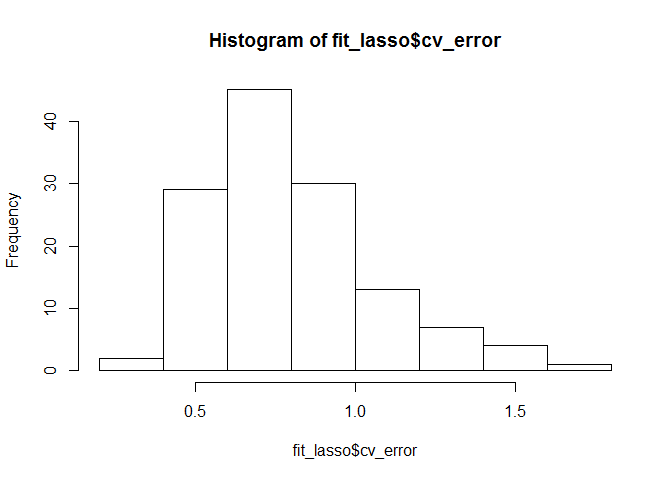
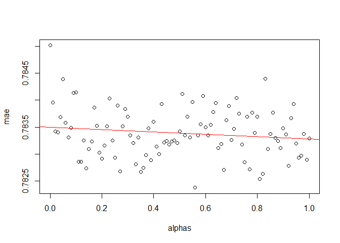

Pillar 1 - Student Topic Profile
================
DARS
2019-04-12

-   [Course topic profile](#course-topic-profile)
-   [Student topic profile](#student-topic-profile)
-   [Student GPA](#student-gpa)
-   [Join student TP and GPA](#join-student-tp-and-gpa)
-   [Regressing grade on TP and GPA](#regressing-grade-on-tp-and-gpa)
    -   [Lasso](#lasso)
    -   [find alpha](#find-alpha)
-   [Green flag](#green-flag)
-   [old code](#old-code)
    -   [CV](#cv)
    -   [BSS](#bss)

**Considerations**:

-   extract course descriptions from courses not offer in 2018-2019 e.g. SCI2012.
-   give more weight to 3000-level courses

-   consider following predictors:
    -   GPA (per concentration)

``` r
load("App/Recommender System/topic_model_gb.RDATA")
load("Output/data_pillar_1.RDATA")
load("Output/course_current.RDATA")

course_target <- course_current[! str_detect(course_current, "...10..")] 
course_target <- setdiff(course_target, "CAP3000") # exclude capstone
course_target <- union(course_target, str_subset(course_current, "COR"))# include core courses
```

Course topic profile
====================

``` r
gamma        <- topic_model_gb$g_overview[[15]] %>% mutate(topic = topic %>% str_replace(" ", "_"))
gamma_spread <- gamma %>% spread(topic, gamma)

beta <- topic_model_gb$b_overview[[15]] %>% group_by(topic) %>% top_n(15, beta)
```

Student topic profile
=====================

``` r
student_TP <- d_transcript_augmented %>% 
  
  left_join(gamma_spread, by = c("Course ID" = "document")) %>%
  
  mutate_at(vars(matches("Topic")), .funs = funs(if_else(is.na(.), 0, .))) %>% # give a value of 0 to the topics of the courses missing from the topic model.
  mutate_at(vars(matches("Topic")), .funs = funs(Grade/10 * .)) %>% # weigh by grade
  
  group_by(`Student ID`, time) %>%
  summarize_at(vars(matches("Topic")), sum) %>% 
  
  group_by(`Student ID`) %>%
  arrange(time) %>%
  
  mutate_at(vars(matches("Topic")), lag, default = 0) %>%
  mutate_at(vars(matches("Topic")), cumsum) %>% # topic profile at beginning of period
  
  ungroup %>%
  
  arrange(`Student ID`)
```

Raphael's topic profile is coherent: topics with a high value correspond to my academic focus and topics with a low score to themes I never covered (i.e. law, literature).

Student GPA
===========

``` r
d_transcript_augmented <- d_transcript_augmented %>%
  
  mutate(is_HUM = `Course ID` %>% str_detect("HUM|SAH"),
         is_SCI = `Course ID` %>% str_detect("SCI|SAS"),
         is_SSC = `Course ID` %>% str_detect("SSC|SAC"),
         is_COR = `Course ID` %>% str_detect("COR"),
         is_SKI = `Course ID` %>% str_detect("SKI|LAN"),
         is_PRO = `Course ID` %>% str_detect("PRO|UGR|CAP")) %>%
  
  mutate(grade_HUM = if_else(is_HUM, Grade, NA_real_),
         grade_SCI = if_else(is_SCI, Grade, NA_real_),
         grade_SSC = if_else(is_SSC, Grade, NA_real_),
         grade_COR = if_else(is_COR, Grade, NA_real_),
         grade_SKI = if_else(is_SKI, Grade, NA_real_),
         grade_PRO = if_else(is_PRO, Grade, NA_real_)) %>%  
  
  mutate(ECTS = case_when(
    `Course ID` %>% str_detect("HUM|SCI|SSC|COR|PRO|SA|EXT") ~ 5  ,
    `Course ID` %>% str_detect("SKI|LAN"                   ) ~ 2.5,
    `Course ID` %>% str_detect("CAP|UGR"                   ) ~ 10 ,
    TRUE                                                     ~ 5  )
    ) %>%

  mutate(ECTS_HUM = if_else(is_HUM, ECTS, NA_real_),
         ECTS_SCI = if_else(is_SCI, ECTS, NA_real_),
         ECTS_SSC = if_else(is_SSC, ECTS, NA_real_),
         ECTS_COR = if_else(is_COR, ECTS, NA_real_),
         ECTS_SKI = if_else(is_SKI, ECTS, NA_real_),
         ECTS_PRO = if_else(is_PRO, ECTS, NA_real_)) %>%
  
  mutate(grade_ECTS     = Grade     * ECTS,
         grade_ECTS_HUM = grade_HUM * ECTS_HUM,
         grade_ECTS_SCI = grade_SCI * ECTS_SCI,
         grade_ECTS_SSC = grade_SSC * ECTS_SSC,
         grade_ECTS_COR = grade_COR * ECTS_COR,
         grade_ECTS_SKI = grade_SKI * ECTS_SKI,
         grade_ECTS_PRO = grade_PRO * ECTS_PRO)
```

``` r
student_GPA <- d_transcript_augmented %>%
  
  group_by(`Student ID`, time) %>%
  summarize_at(vars(matches("ECTS")), list) %>%
  
  group_by(`Student ID`) %>%
  arrange(time) %>%
  
  mutate_at(vars(matches("ECTS")), purrr::accumulate, c) %>%
  
  mutate_at(vars(matches("ECTS")), map_dbl, sum, na.rm = TRUE) %>%
  
  mutate(GPA     = grade_ECTS     / ECTS,
         GPA_HUM = grade_ECTS_HUM / ECTS_HUM,
         GPA_SCI = grade_ECTS_SCI / ECTS_SCI,
         GPA_SSC = grade_ECTS_SSC / ECTS_SSC,
         GPA_COR = grade_ECTS_COR / ECTS_COR,
         GPA_SKI = grade_ECTS_SKI / ECTS_SKI,
         GPA_PRO = grade_ECTS_PRO / ECTS_PRO) %>%
  
  mutate_at(vars(matches("GPA")), lag) %>%
  
  mutate_at(vars(matches("GPA")), ~ if_else(is.na(.), mean(d_transcript_augmented$Grade), .)) %>% # substitute missing GPA with the mean GPA across all courses (GPA_HUM is missing if student has no taken any HUM course yet)
  
  arrange(`Student ID`) 
```

Join student TP and GPA
=======================

``` r
student_profile <- d_transcript_augmented %>%
  
  left_join(student_GPA, by = c("Student ID", "time")) %>%
  
  left_join(student_TP , by = c("Student ID", "time"))
```

Regressing grade on TP and GPA
==============================

``` r
find_df <- function(course)  student_profile %>% filter(`Course ID` == course)
```

Lasso
-----

``` r
my_cv.glmnet <- function(df, alpha = 1, predictors){
  
  df <- df %>% select(Grade, matches(predictors))
  
  y <- df[names(df) == "Grade"] %>% as.matrix
  x <- df[names(df) != "Grade"] %>% as.matrix
  
  nfold <- min(10, floor(nrow(df) / 3))
  
  cv.glmnet(x, y, nfolds = nfold, type.measure = "mae", alpha = alpha)
  
}
```

``` r
fit_lasso <- tibble(target = course_target) %>%
  
  mutate(d = target %>% map(find_df),
         n = d      %>% map_dbl(nrow)) %>%
  
  filter(n > 20) %>%
  
  mutate(cv = d %>% map(my_cv.glmnet, predictors = "GPA|Topic")) %>%
  
  select(-d)
```

``` r
fit_lasso <- fit_lasso %>%
  
  # Results from CV
  mutate(m_lasso      = cv %>% map    (~ .[["glmnet.fit"]]),
         lambda_min   = cv %>% map_dbl(~.[["lambda.min"]]),
         lambda_1se   = cv %>% map_dbl(~.[["lambda.1se"]]),
         index_best   = cv %>% map_dbl(~ which.min(.[["cvm"]])),
         cv_error     = list(cv, index_best) %>% pmap_dbl(~ ..1[["cvm"]][..2]),
         cv_error_sd  = list(cv, index_best) %>% pmap_dbl(~ ..1[["cvsd"]][..2])
         ) %>%
  
  select(- cv) %>%
  
  # Best model
  mutate(
    
    intercept  = list(m_lasso, index_best) %>% pmap_dbl(~ ..1[["a0"]][..2]),
    coefi      = list(m_lasso, lambda_min) %>% pmap(coef), # clearer output than pmap_dbl(~ ..1[["beta"]][,..2])
    df         = list(m_lasso, index_best) %>% pmap_dbl(~ ..1[["df"]][..2]),
    
    dev_null   = m_lasso %>% map_dbl(~ .[["nulldev"]]),
    dev_left   = list(m_lasso, index_best) %>% pmap_dbl(~deviance.glmnet(..1)[..2]),
    dev_unexpl = dev_null - dev_left,
    dev_ratio  = list(m_lasso, index_best) %>% pmap_dbl(~ ..1[["dev.ratio"]][..2])
    
  ) %>%
  
  select(- m_lasso) %>%
  
  arrange(cv_error)
```

``` r
hist(fit_lasso$cv_error)
```



``` r
mean(fit_lasso$cv_error); weighted.mean(fit_lasso$cv_error, fit_lasso$n)
```

    ## [1] 0.8052675

    ## [1] 0.7823819

Topic chosen by model are related to the course.

``` r
i <- 2; fit_lasso$coefi[[i]]; fit_lasso$target[[i]] # topic ~ law, foreign policy, culture
```

    ## 38 x 1 sparse Matrix of class "dgCMatrix"
    ##                        1
    ## (Intercept)  3.623075583
    ## GPA          0.278878194
    ## GPA_HUM      .          
    ## GPA_SCI      0.024351817
    ## GPA_SSC      0.006535114
    ## GPA_COR      .          
    ## GPA_SKI      0.231453495
    ## GPA_PRO      .          
    ## Topic_1      .          
    ## Topic_10     .          
    ## Topic_11     .          
    ## Topic_12     .          
    ## Topic_13     .          
    ## Topic_14     .          
    ## Topic_15     .          
    ## Topic_16     .          
    ## Topic_17     0.048710957
    ## Topic_18     0.103270722
    ## Topic_19     .          
    ## Topic_2      .          
    ## Topic_20     .          
    ## Topic_21     .          
    ## Topic_22     .          
    ## Topic_23     .          
    ## Topic_24     .          
    ## Topic_25    -0.199076567
    ## Topic_26     .          
    ## Topic_27     .          
    ## Topic_28     .          
    ## Topic_29     .          
    ## Topic_3      .          
    ## Topic_30     .          
    ## Topic_4      .          
    ## Topic_5      .          
    ## Topic_6      .          
    ## Topic_7      .          
    ## Topic_8      0.136020985
    ## Topic_9      .

    ## [1] "SSC3038"

``` r
i <- 12; fit_lasso$coefi[[i]]; fit_lasso$target[[i]] # history of western pol. thought predicted by HUM
```

    ## 38 x 1 sparse Matrix of class "dgCMatrix"
    ##                      1
    ## (Intercept)  7.3435912
    ## GPA          .        
    ## GPA_HUM      .        
    ## GPA_SCI      .        
    ## GPA_SSC      0.1087329
    ## GPA_COR      .        
    ## GPA_SKI      .        
    ## GPA_PRO      .        
    ## Topic_1      .        
    ## Topic_10     .        
    ## Topic_11     .        
    ## Topic_12     .        
    ## Topic_13     .        
    ## Topic_14     .        
    ## Topic_15     .        
    ## Topic_16     .        
    ## Topic_17    -0.4818858
    ## Topic_18     .        
    ## Topic_19     .        
    ## Topic_2      .        
    ## Topic_20     .        
    ## Topic_21     .        
    ## Topic_22     .        
    ## Topic_23     .        
    ## Topic_24     .        
    ## Topic_25     .        
    ## Topic_26     .        
    ## Topic_27     .        
    ## Topic_28     .        
    ## Topic_29     .        
    ## Topic_3      .        
    ## Topic_30     .        
    ## Topic_4      .        
    ## Topic_5      .        
    ## Topic_6      .        
    ## Topic_7      .        
    ## Topic_8      .        
    ## Topic_9      .

    ## [1] "UGR3003"

``` r
i <- 3; fit_lasso$coefi[[i]]; fit_lasso$target[[i]] # topic ~ literature, art, culture
```

    ## 38 x 1 sparse Matrix of class "dgCMatrix"
    ##                       1
    ## (Intercept)  4.56120708
    ## GPA          0.04590077
    ## GPA_HUM      .         
    ## GPA_SCI      .         
    ## GPA_SSC      0.24487218
    ## GPA_COR      0.02433523
    ## GPA_SKI      0.12389364
    ## GPA_PRO      .         
    ## Topic_1      .         
    ## Topic_10     .         
    ## Topic_11     .         
    ## Topic_12     .         
    ## Topic_13     .         
    ## Topic_14     .         
    ## Topic_15     .         
    ## Topic_16     .         
    ## Topic_17     .         
    ## Topic_18     .         
    ## Topic_19     .         
    ## Topic_2      0.04094893
    ## Topic_20     .         
    ## Topic_21     0.17917753
    ## Topic_22     .         
    ## Topic_23     0.34315347
    ## Topic_24     .         
    ## Topic_25     .         
    ## Topic_26    -0.17314549
    ## Topic_27     .         
    ## Topic_28     .         
    ## Topic_29     .         
    ## Topic_3      .         
    ## Topic_30     .         
    ## Topic_4      .         
    ## Topic_5      .         
    ## Topic_6      .         
    ## Topic_7      .         
    ## Topic_8      .         
    ## Topic_9      .

    ## [1] "SSC3044"

find alpha
----------

``` r
n_alpha <- 101
mae   <- numeric(n_alpha)
alphas <- seq(0, 1, length.out = n_alpha)

for(i in 1 : n_alpha){
  
  fit_lasso <- tibble(target = course_target) %>%
  
    mutate(d = target %>% map(find_df),
           n = d      %>% map_dbl(nrow)) %>%
    
    filter(n > 20) %>%
    
    mutate(cv = d %>% map(my_cv.glmnet, alpha = alphas[i], predictors = "GPA|Topic")) %>%
    
    mutate(index_best = cv                   %>% map_dbl (~ which.min(.[["cvm"]])),
           cv_error   = list(cv, index_best) %>% pmap_dbl(~ ..1[["cvm"]][..2]    ))
    
  mae[i] <- weighted.mean(fit_lasso$cv_error, fit_lasso$n)
  
}

# slight decrease in mae as alpha increase. Set alpha = 1 in my_cv.glmnet().
m <- lm(mae ~ alphas)
plot(alphas, mae)
abline(m, col = "red")
```



``` r
m %>% summary
```

    ## 
    ## Call:
    ## lm(formula = mae ~ alphas)
    ## 
    ## Residuals:
    ##        Min         1Q     Median         3Q        Max 
    ## -9.940e-04 -2.674e-04 -2.928e-05  3.161e-04  1.519e-03 
    ## 
    ## Coefficients:
    ##               Estimate Std. Error t value Pr(>|t|)    
    ## (Intercept)  7.835e-01  8.961e-05  8743.3   <2e-16 ***
    ## alphas      -2.167e-04  1.548e-04    -1.4    0.165    
    ## ---
    ## Signif. codes:  0 '***' 0.001 '**' 0.01 '*' 0.05 '.' 0.1 ' ' 1
    ## 
    ## Residual standard error: 0.0004536 on 99 degrees of freedom
    ## Multiple R-squared:  0.01941,    Adjusted R-squared:  0.009506 
    ## F-statistic:  1.96 on 1 and 99 DF,  p-value: 0.1647

Green flag
==========

``` r
fit_lasso_topic <- tibble(target = course_target) %>%
  
  mutate(d = target %>% map(find_df),
         n = d      %>% map_dbl(nrow)) %>%
  
  filter(n > 20) %>%
  
  mutate(cv = d %>% map(my_cv.glmnet, alpha = 0, predictors = "Topic")) %>%
  
  select(-d)
```

``` r
fit_lasso_topic <- fit_lasso_topic %>%
  
  # Results from CV
  mutate(m_lasso      = cv %>% map    (~ .[["glmnet.fit"]]),
         lambda_min   = cv %>% map_dbl(~ .[["lambda.min"]]),
         index_best   = cv %>% map_dbl(~ which.min(.[["cvm"]]))
         ) %>%
  
  select(- cv) %>%
  
  # Best model
  mutate(coefi_v = list(m_lasso, index_best) %>% pmap(~ ..1[["beta"]][,..2]),
         coefi_v = coefi_v %>% map(~ tibble(topic = names(.), weight = .)),
         coefi_m = list(m_lasso, lambda_min) %>% pmap(coef)) %>% 
  
  # extract coefficients
  unnest(coefi_v)%>%
  
  select(target, topic, weight)

View(fit_lasso_topic)
```

``` r
d_prep <- fit_lasso_topic %>% 
  
  left_join(gamma, by = "topic") %>%
  rename(preparation = document) %>%
  filter(target != preparation) %>%
  
  # exclude 3000 (advanced) courses from preparation courses
  filter(!preparation %>% str_detect("^...30")) %>% 
  
  # double prep_score of intro courses
  mutate(is_intro = preparation %>% str_detect("^...10")) %>%
  mutate(weight = weight * (1 + is_intro)) %>%
  
  # prep_score
  mutate(prep_score = weight * gamma) %>%
  
  # aggregate prep_score
  group_by(target, preparation) %>%
  summarize(prep_score = sum(prep_score)) %>%
  
  # identify top 15 preparation courses for each course
  group_by(target) %>%
  top_n(15, prep_score) %>%
  arrange(target, desc(prep_score))

View(d_prep)  
```

old code
========

CV
--

``` r
my_predict <- function(model, newdata, id){
  
  df    <- as.matrix(newdata)
  coefi <- coef(model, id = id)
  xvars <- names(coefi)[-1]
  
  coefi[1] + df[ , xvars, drop = FALSE] %*% coefi[-1]
  
}
```

``` r
my_CV <- function(df){
  
  k <- 10
  set.seed(2019)
  folds <- sample( 1 : k, nrow(df), replace = TRUE)
  
  nvmax <- 5
  cv.errors <- matrix(NA, k, nvmax, dimnames = list(NULL, paste(1 : nvmax, "predictor(s)")))
  
  for(j in 1 : k){
    
    training <- df[folds != j, ]
    test     <- df[folds == j, ]
  
    m <- regsubsets(Grade ~ ., data = training, nvmax = nvmax)
    
    for(i in 1 : nvmax){
      
      pred            <- my_predict(model = m, newdata = test, id = i)
      pred            <- pmin(10, pred)
      pred            <- pmax(0, pred)
      cv.errors[j, i] <- mean(abs(test$Grade - as.vector(pred)))
      
    }
    
  }
  
  cv.errors
  
}
```

BSS
---

``` r
my_BSS <- function(df) regsubsets(Grade ~ ., data = df, nvmax = 7)
```

``` r
extract_coef <- function(BSS, BS) names(coef(BSS, BS))[-1]
```

``` r
my_lm <- function(df, best_coef){
  
  best_coef %>%
    
    paste0(collapse = " + ") %>%
    paste0("Grade ~ ", .) %>%
    as.formula %>%
  
    lm(data = df)
  
}
```

``` r
BSS <- tibble(target = course_obj) %>%
  
  mutate(df = target %>% map(find_df),
         n = df %>% map(nrow)) %>%
  
  filter(n >= 25) %>%
  
  mutate(BSS = df %>% map(my_BSS)) %>%
  
  mutate(CV_error      = df %>% map(my_CV),
         CV_error_mean = CV_error %>% map(colMeans),
         n_pred        = CV_error_mean %>% map_dbl(which.min),
         best_coef     = list(BSS, n_pred) %>% pmap(extract_coef),
         best_model    = list(df, best_coef) %>% pmap(my_lm)
         ) %>%
  
  mutate(tidied    = best_model %>% map(broom::tidy   ),
         glanced   = best_model %>% map(broom::glance ),
         augmented = best_model %>% map(broom::augment)) %>%
  
  select(target, n, tidied, glanced, augmented)
```

``` r
BSS_glance <- BSS %>% unnest(glanced) %>% select(-c(tidied, augmented)) %>%
  
  mutate(MSE = deviance / df.residual )

View(BSS_glance)
```

``` r
course <- "HUM2021"

BSS_tidy_temp <- BSS %>% filter(target == course) %>% unnest(tidied, .drop = F) %>% select(-c(glanced, augmented))

View(BSS_tidy_temp)

BSS_augm_temp <- BSS %>% filter(target == course) %>% unnest(augmented, .drop = FALSE) %>% select(-c(tidied, glanced))

View(BSS_augm_temp)
```
